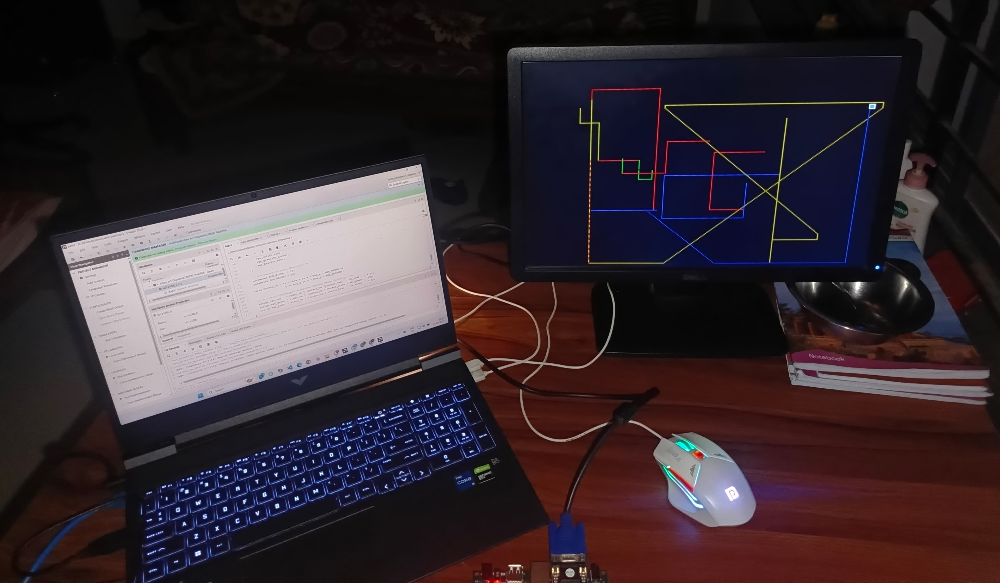
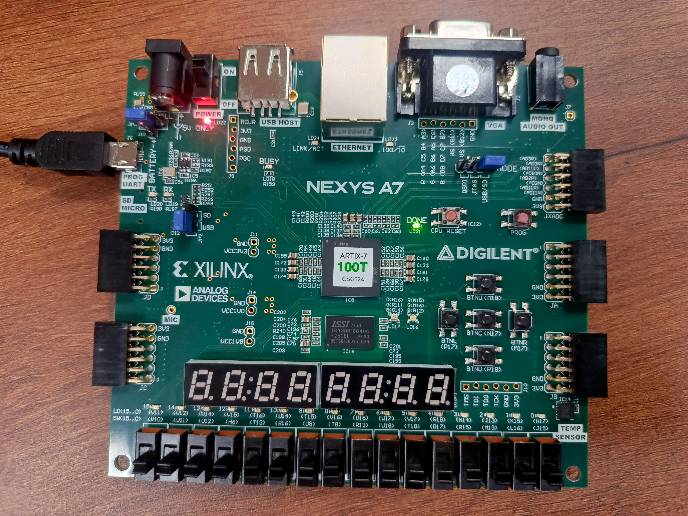
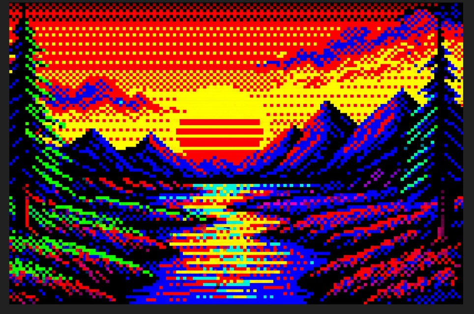

# 🎨 VGA Paint Tool using Nexys A7 FPGA

This project demonstrates a **fully interactive VGA Paint Tool** built using the **Nexys A7 FPGA Board**. Users can draw on a VGA screen using colored pixels controlled by switches and erase using a dedicated button. The mouse or directional input controls the cursor position.

We used Verilog HDL for the design, and the project outputs visuals on a VGA monitor connected to the board.  

✅ Constraint file used in this project is **specifically made for the Nexys A7**.

---

## 🖥️ Setup View

  

---

## 🔧 Nexys A7 FPGA Board

  

---

## 🖌️ Sample VGA Artwork Output

  

---

## 🛠️ Features

- Built on the **Nexys A7 (Artix-7)** FPGA platform.
- Real-time cursor control via inputs.
- 16 selectable colors using digital inputs (switches).
- Eraser mode activated with a push button.
- VGA output to external monitor.
- Clean Verilog implementation.

---

## 📁 Files Included

- `paint_tool.v`: Main Verilog module.
- `vga_controller.v`: Handles VGA timing and sync.
- `color_select.v`: Maps input switches to colors.
- `constraints.xdc`: Nexys A7 specific constraint file.
- `README.md`: You're reading it 🙂

---

## 📌 How to Use

1. Clone or download the project files.
2. Open the project in **Vivado**.
3. Use the `constraints.xdc` file provided for pin mapping to Nexys A7.
4. Connect a VGA monitor to the board.
5. Program the board and enjoy drawing using the switches and buttons.

---

## 🔗 Credits

Developed with love using Verilog and the Nexys A7 board 💚  
For any queries or collaboration, feel free to reach out!

---

